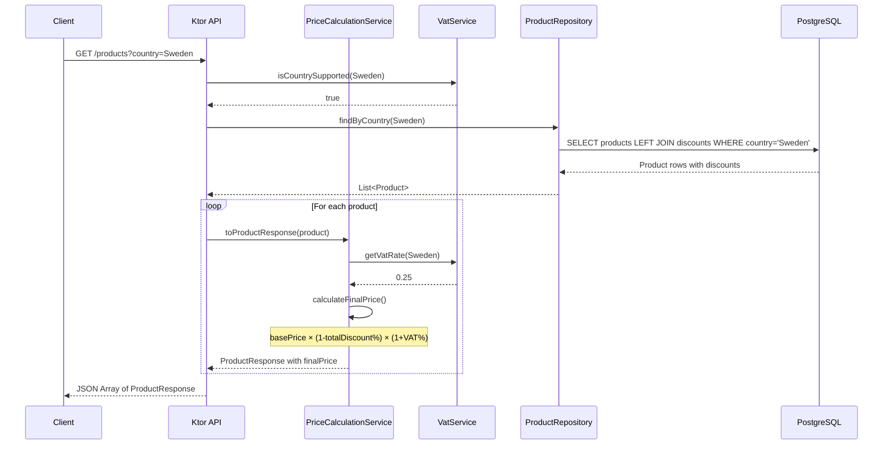
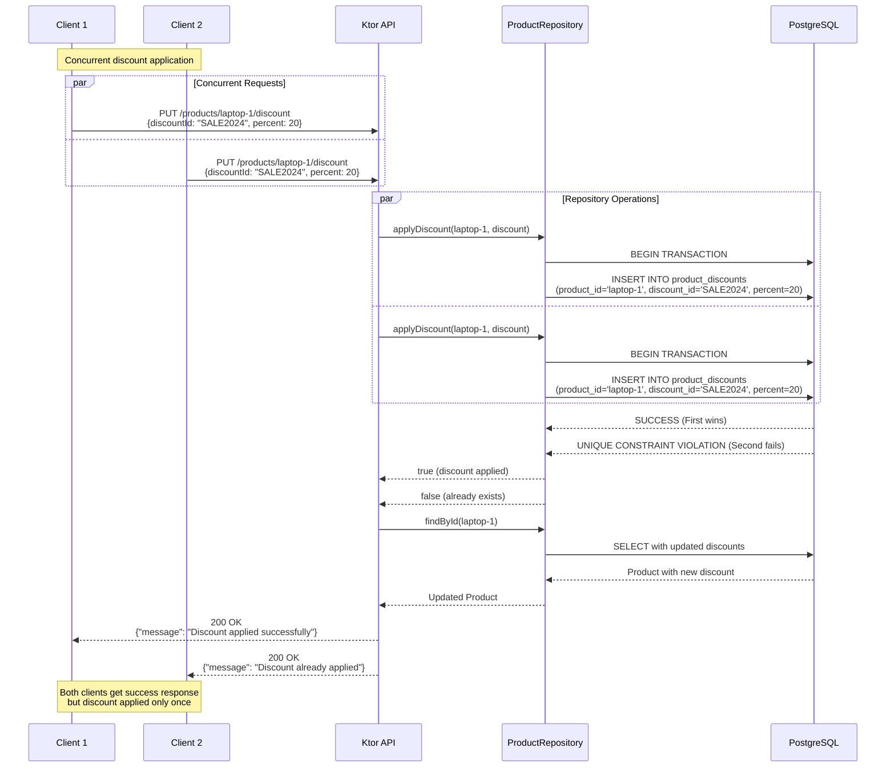
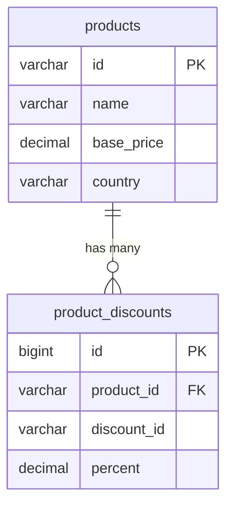

# Architecture Documentation

## System Design Overview

This Product API is built using **Ktor** (Kotlin web framework) with **PostgreSQL** as the persistent database. The architecture follows clean architecture principles with clear separation of concerns.

### Key Components

1. **Ktor Application Layer**: REST API endpoints with JSON serialization
2. **Service Layer**: Business logic for price calculation and VAT handling
3. **Repository Layer**: Database access with Exposed ORM
4. **Database Layer**: PostgreSQL with connection pooling (HikariCP)

### Technology Stack

- **Framework**: Ktor 3.1.2 with Netty server
- **Language**: Kotlin 2.2.20
- **Database**: PostgreSQL with Exposed ORM
- **Connection Pooling**: HikariCP
- **Testing**: TestContainers for integration testing
- **Serialization**: Kotlinx Serialization

## Concurrency Control Strategy

The core requirement is to ensure **"The same discount cannot be applied more than once to the same product — even under heavy concurrent load."**

### Database-Level Concurrency Control

We implement concurrency control at the **database level** using PostgreSQL's ACID properties:

```sql
-- Unique constraint on product_discounts table
CREATE UNIQUE INDEX product_discounts_unique_idx 
ON product_discounts (product_id, discount_id);
```

### How It Works

1. **Unique Constraint**: The `(product_id, discount_id)` combination must be unique
2. **Atomic Operations**: All discount applications use database transactions
3. **Idempotent Behavior**: Duplicate attempts return gracefully without side effects
4. **Race Condition Prevention**: PostgreSQL handles concurrent insertions atomically

### Idempotency Implementation

```kotlin
fun applyDiscount(productId: String, discount: Discount): Boolean = transaction {
    try {
        // Attempt to insert discount - will fail if already exists
        ProductDiscounts.insert { ... }
        true // Successfully applied
    } catch (e: ExposedSQLException) {
        if (e.message?.contains("unique constraint") == true) {
            false // Already exists - idempotent
        } else {
            throw e // Other error
        }
    }
}
```

## Price Calculation Formula

The final price calculation implements the exact formula from requirements:

**`finalPrice = basePrice × (1 - totalDiscount%) × (1 + VAT%)`**

### Country VAT Rules

The system supports three countries with their respective VAT rates as specified in the requirements:

| Country | VAT |
|----------|-----|
| Sweden | 25% |
| Germany | 19% |
| France | 20% |

These rates are implemented in the `VatService` and validated for each product request.

### Compound Discount Calculation

Multiple discounts are compounded using this formula:
```
totalDiscountPercent = 1 - (1-d1/100) × (1-d2/100) × ... × (1-dn/100)
```

Example with 10% and 5% discounts:
- `totalDiscount = 1 - (1-0.10) × (1-0.05) = 1 - 0.90 × 0.95 = 14.5%`

## API Endpoints

### GET /products?country={country}

Returns all products for a specific country with calculated final prices.



### PUT /products/{id}/discount

Applies a discount to a product with concurrency safety and idempotency.



## Database Schema

### Tables

**products**
- `id` (VARCHAR, PRIMARY KEY): Product identifier
- `name` (VARCHAR): Product name
- `base_price` (DECIMAL): Price before discounts/VAT
- `country` (VARCHAR): Country for VAT calculation

**product_discounts**
- `id` (BIGINT, AUTO_INCREMENT, PRIMARY KEY): Internal ID
- `product_id` (VARCHAR, FOREIGN KEY): References products.id
- `discount_id` (VARCHAR): Discount identifier for idempotency
- `percent` (DECIMAL): Discount percentage
- **UNIQUE CONSTRAINT**: `(product_id, discount_id)` ← **Concurrency Control**

### Entity Relationship



## Error Handling

The API provides proper HTTP status codes:

- **200 OK**: Successful operation
- **400 Bad Request**: Invalid input (missing country, invalid discount%)
- **404 Not Found**: Product doesn't exist
- **500 Internal Server Error**: Database or system errors

## Testing Strategy

### Concurrency Test

The critical test `testConcurrentDiscountApplication()` simulates the exact requirement:

```kotlin
@Test
fun testConcurrentDiscountApplication() = runBlocking {
    val numberOfConcurrentRequests = 10
    
    // Launch 10 simultaneous requests to apply same discount
    val concurrentRequests = (1..numberOfConcurrentRequests).map {
        async {
            client.put("/products/headphones-se/discount") {
                // Same discount request
            }
        }
    }
    
    val responses = concurrentRequests.awaitAll()
    
    // Verify: All return 200 OK, but discount applied exactly once
    // This proves concurrency safety at database level
}
```

## Production Considerations

1. **Connection Pooling**: HikariCP configured with proper limits
2. **Database Indexes**: Unique constraint serves dual purpose (integrity + performance)
3. **Transaction Isolation**: ACID compliance ensures data consistency
4. **Error Handling**: Graceful degradation with proper HTTP status codes
5. **Testing**: TestContainers ensure database behavior matches production
